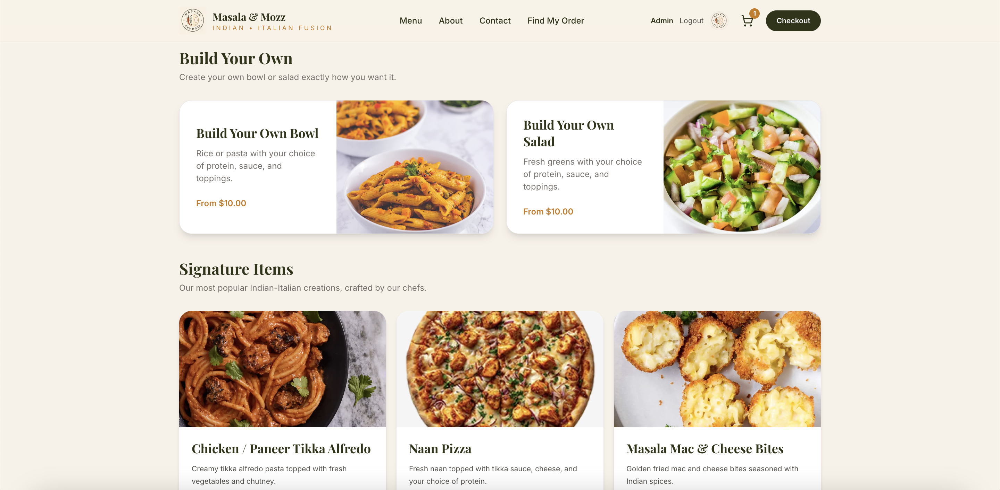

# MasalaMozz 🍽️

A full-stack restaurant ordering platform built with **Next.js**, **TypeScript**, and **Supabase**.



## Overview

MasalaMozz is a modern restaurant ordering application designed to provide a complete digital ordering experience. Customers can browse menu items, customize dishes, place orders, and track their purchases through a responsive web interface.

The application includes customer-facing ordering features as well as restaurant management tools for handling orders and menu updates.

## Features

### Customer Experience

* Browse restaurant menu items
* Customize signature dishes
* Add items to cart
* Complete checkout flow
* Payment processing workflow
* Order confirmation and tracking
* Address autocomplete

### Restaurant Management

* Admin order management
* Menu management and updates
* Customizable menu items
* Streamlined order workflow

## Tech Stack

### Frontend

* Next.js
* React
* TypeScript
* Tailwind CSS

### Backend

* Supabase
* Database integration
* Backend application logic

### Deployment

* Vercel

## Architecture

```
Next.js Frontend
        |
        |
Supabase Backend
        |
        |
Database + Application Services
```

## Running Locally

Clone the repository:

```bash
git clone https://github.com/beirong2/masalamozz.git
cd masalamozz
```

Install dependencies:

```bash
npm install
```

Start the development server:

```bash
npm run dev
```

Open the application:

```
http://localhost:3000
```

## Project Highlights

* Built a complete restaurant ordering workflow from menu browsing to order completion
* Implemented customizable menu items and dynamic ordering logic
* Developed backend functionality using Supabase
* Created an admin workflow for managing restaurant operations
* Deployed a production-ready application using Vercel

## Future Improvements

* Mobile-first optimization
* Customer accounts and order history
* Advanced analytics dashboard
* Additional payment integrations

## Live Demo

[MasalaMozz](https://masalamozz.vercel.app)
